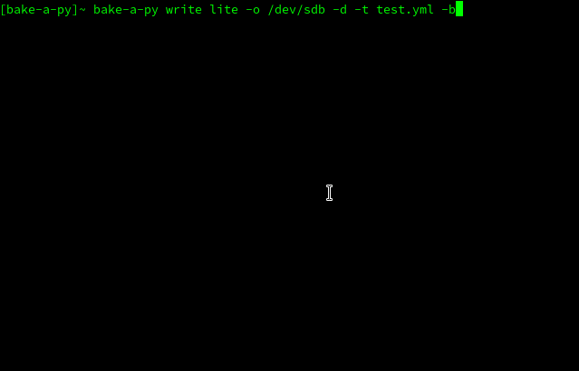

# Bake-a-py

Bake-a-py is a simple commandline utility for Linux written in Python. The programm is intended for provisioning Raspberry Pis with Raspberry Pi OS and the fundamental configuration. It mimicks the rpi-imager, but is a command line tool. This helps in my case creating a basic setup on the SD card or USB drive.



## Installation

The installation from Github is rather simple. Just run

```bash
pip install --user https://github.com/derSuessmann/bake-a-py/archive/refs/heads/main.zip
```

Or use any of the other methods... ;)